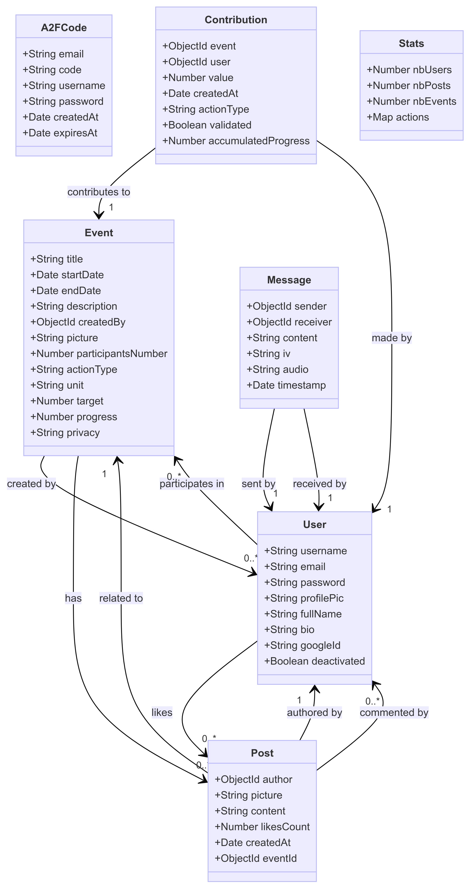

# Backend de ProjectX

Ce backend est construit avec Node.js et MongoDB, conçu pour gérer les utilisateurs, les publications, les événements et les statistiques efficacement. Il fournit des endpoints d'API RESTful pour diverses opérations, y compris la gestion des utilisateurs, la création et la manipulation des publications, la gestion des événements et le suivi des statistiques.

---

## Technologies Utilisées

- Node.js
- Express
- MongoDB
- Mongoose
- Firebase (pour le stockage des fichiers)

---

## Capture d'écran

BackEnd réalisé sous ce modèle (diagramme de classe)

---

## Démarrage

Pour démarrer avec ce projet, suivez les étapes ci-dessous :

1. Installez Node.js et npm sur votre machine.
2. Clonez le dépôt : git clone https://github.com/DALGONA-MASTERS/server.git
3. Installez les dépendances : npm install
4. Exécutez le serveur de développement : npm start
5. Ouvrez votre navigateur et visitez http://localhost:8042 pour accéder à l'application.
6. Ou accédez directement au backend déployé sur : https://server-vgg7.onrender.com

---
